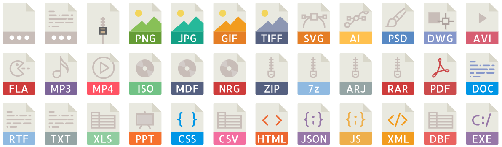

# Icons File Extension

This is a repository created based in a npm package [pretty-file-icons](https://github.com/kravets-levko/pretty-file-icons)

Pretty colorful icons for files (in svg format).

Icon pack author: [Madebyoliver](http://www.flaticon.com/authors/madebyoliver).
Icons are published as-is and under the licence by [flaticon.com](http://flaticon.com).
Licence for everything except icons is MIT.

See [icons.json](icons.json) for available icons list.

## Preview:
  

 
## Usage
 
```
bower install icons-file-extension
```
 
In addition, this package contains mapping for some file extensions - see the
[index.json](index.json) file. Also, it can be used in javascript applications 
to retrieve icon names by file name:
```javascript
var path_to_icons = '/bower_components/icons-file-extension/svg';

console.log( path_to_icons + getIcon('test.csv'));
console.log( path_to_icons + getIcon('test.pdf'));
console.log( path_to_icons + getIcon('test.test'));

// Prints:
// /bower_components/icons-file-extension/svg/csv.svg
// /bower_components/icons-file-extension/svg/pdf.svg
// /bower_components/icons-file-extension/svg/unknown.svg
```
